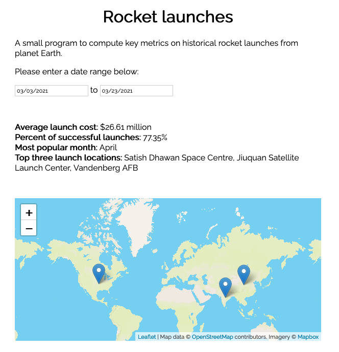

To run:

```
  $ npm install
  $ cd <project-folder>
  $ http-server --cors .

  Navigate to localhost:8080
```

Development notes:

- I went with the most barebones approach possible, using just vanilla html/js/css, with a couple of imports for fonts and nice styling. For production work I'll almost always use React/Rollup/SCSS and other standard frameworks. Happy to provide samples.
- CORS should be enabled on the server for API access. Just copying a sample JSON for now.
- With the API, I don't see a way to get a list of available companyIDs. I did find the .csv in the server code that list the companies (1 - 56), but there should probably be an API call to get a generic list of companies.
- There's lots of checks and error-handling I would be doing to ensure that the API data is formatted correctly. For now, we're just assuming that the provided values encompass the whole dataset (eg, we don't verify that "USA" could be "United States" or other variations with a discrete country ID).
- `lodash-es` native ES6 module loading makes the initial page pretty slow. This would be fixed easily with a bundler.
- Does `launch_locations` refer to siteName, platform, or unique locationID? (Assuming locationID would be most accurate, but just using siteName for now for display purposes)
  - In a similar issue, there is a `topCountries` property that we could use for the 'top the countries on a map' calculation, but the `topLocations` property seems to provide more granular data for the calculation (and they sometime seem to conflict, as with companyID 21).
